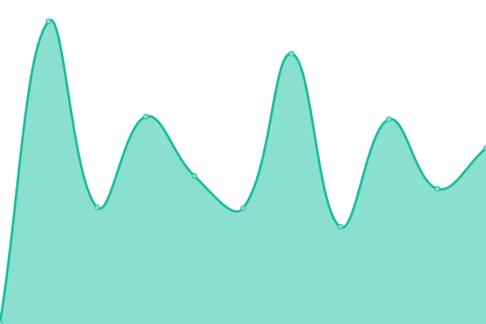
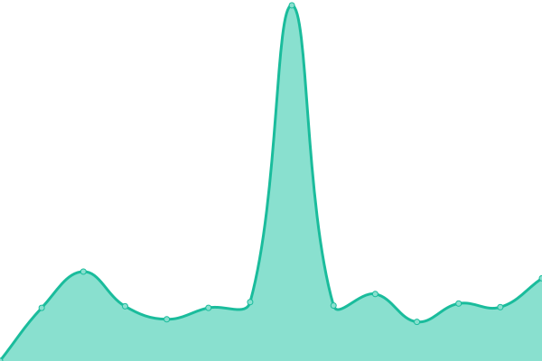

# [📈 Live Status](https://status.v434project.com): <!--live status--> **🟩 All systems operational**

This repository contains the open-source uptime monitor and status page for [Valentin Binotto](https://v4zen.com).

<!--start: status pages-->
<!-- This summary is generated by Upptime (https://github.com/upptime/upptime) -->
<!-- Do not edit this manually, your changes will be overwritten -->
<!-- prettier-ignore -->
| URL | Status | History | Response Time | Uptime |
| --- | ------ | ------- | ------------- | ------ |
|  [v4zen.org](https://v4zen.org) | 🟩 Up | [v4zen-org.yml](https://github.com/valentinbinotto/status/commits/HEAD/history/v4zen-org.yml) | 

 227ms
     
 | 

<a href="https://status.v434project.org/history/v4zen-org">100.00%</a>
    

|  [v434project.org](https://v434project.org) | 🟩 Up | [v434project-org.yml](https://github.com/valentinbinotto/status/commits/HEAD/history/v434project-org.yml) | 

 264ms
     
 | 

<a href="https://status.v434project.org/history/v434project-org">100.00%</a>
    

|  [V434Space](https://v434.cloud.mattermost.com) | 🟩 Up | [v434-space.yml](https://github.com/valentinbinotto/status/commits/HEAD/history/v434-space.yml) | 

 302ms
     
 | 

<a href="https://status.v434project.org/history/v434-space">100.00%</a>
    

|  [blog.vlentin.com](https://blog.vlentin.com) | 🟩 Up | [blog-vlentin-com.yml](https://github.com/valentinbinotto/status/commits/HEAD/history/blog-vlentin-com.yml) | 

 607ms
     
 | 

<a href="https://status.v434project.org/history/blog-vlentin-com">100.00%</a>
    

|  [v4jp.com](https://v4jp.com/uptimetest) | 🟩 Up | [v4jp-com.yml](https://github.com/valentinbinotto/status/commits/HEAD/history/v4jp-com.yml) | 

 155ms
     
 | 

<a href="https://status.v434project.org/history/v4jp-com">100.00%</a>
    

|  [v434infranet.net](http://v434infranet.net/) | 🟩 Up | [v434infranet-net.yml](https://github.com/valentinbinotto/status/commits/HEAD/history/v434infranet-net.yml) | 

 230ms
     
 | 

<a href="https://status.v434project.org/history/v434infranet-net">100.00%</a>
    

|  [v434infranet.org](http://v434infranet.org/) | 🟩 Up | [v434infranet-org.yml](https://github.com/valentinbinotto/status/commits/HEAD/history/v434infranet-org.yml) | 

 404ms
     
 | 

<a href="https://status.v434project.org/history/v434infranet-org">100.00%</a>
    

<!--end: status pages-->

[**Visit our status website →**](https://status.v434project.com)

## 📄 License

- Powered by: [Upptime](https://github.com/upptime/upptime)
- Code: [MIT](./LICENSE) © [Valentin Binotto](v4zen.com)
- Data in the `./history` directory: [Open Database License](https://opendatacommons.org/licenses/odbl/1-0/)
